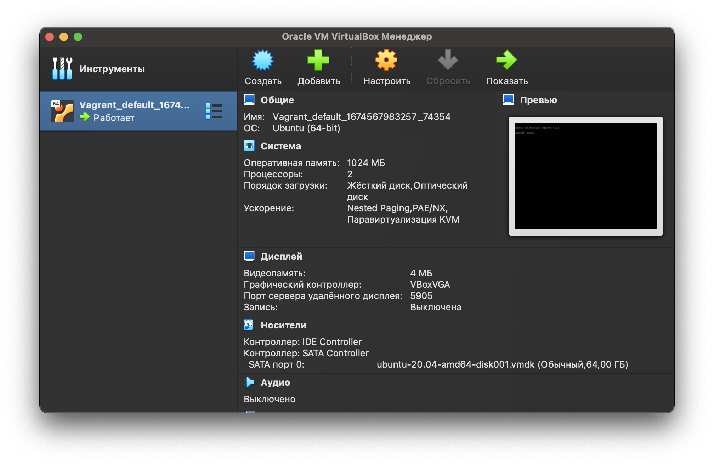
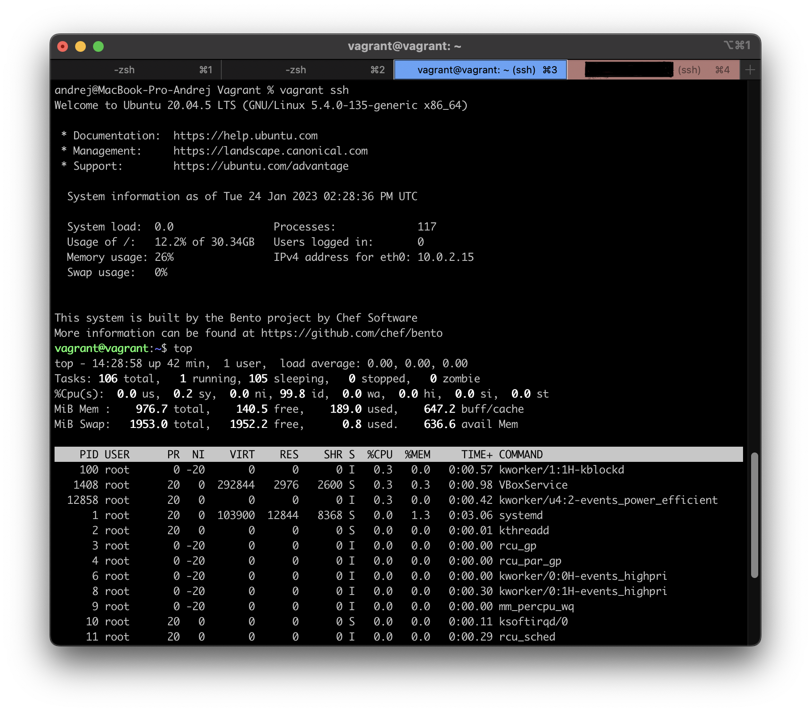
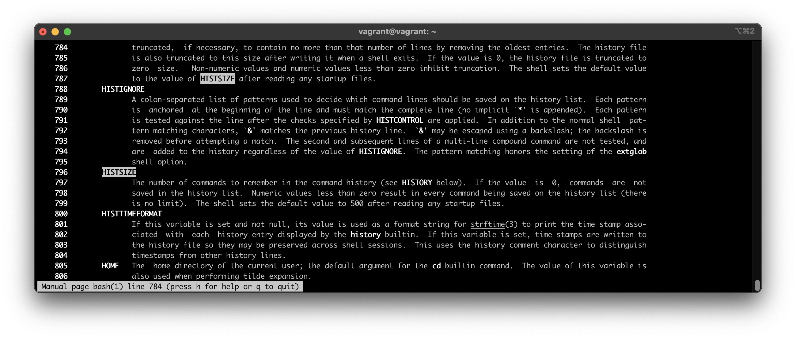
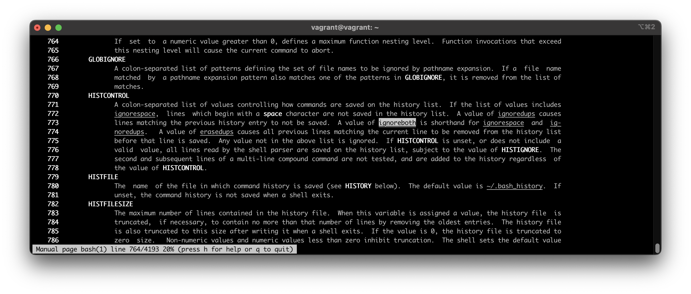
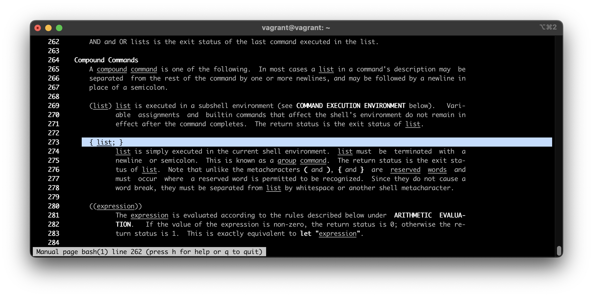
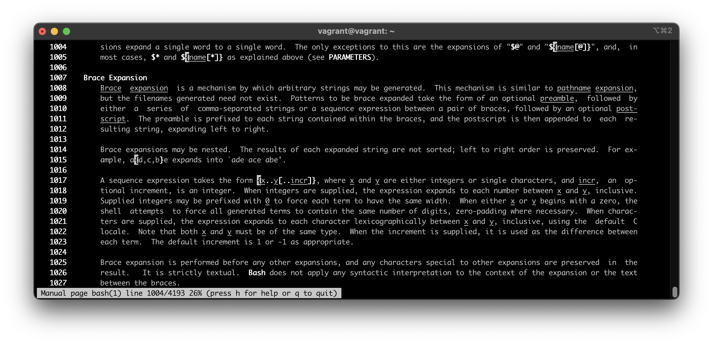
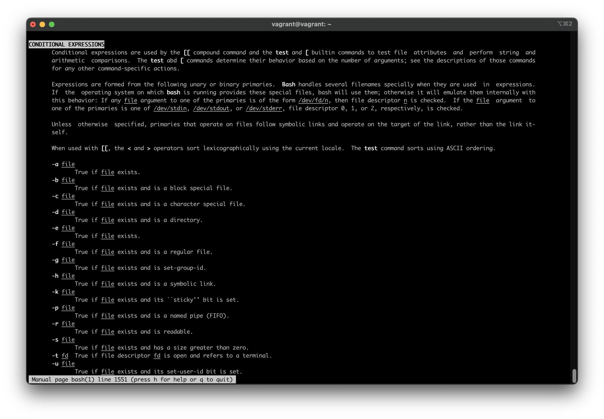
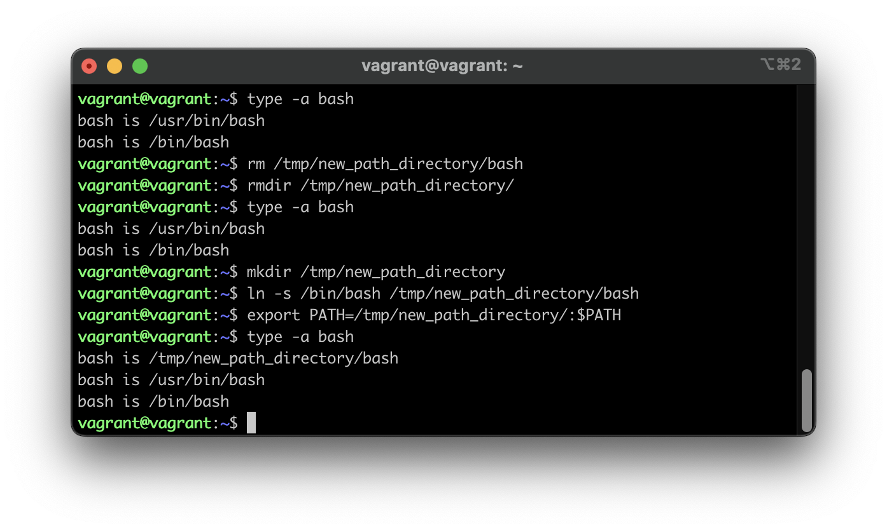

## Задание

1. С помощью базового файла конфигурации запустите Ubuntu 20.04 в VirtualBox посредством Vagrant..

> - Инициализировал Vagrand командой `vagrant init`
> - Запустил ВМ командой `vagrant up`
> - Попробовал команды выключения и остановки, `vagrant suspend` и `vagrant halt` соотвественно

2. Ознакомьтесь с графическим интерфейсом VirtualBox, посмотрите как выглядит виртуальная машина, которую создал для вас Vagrant, какие аппаратные ресурсы ей выделены. Какие ресурсы выделены по-умолчанию?

> Выделено:
>
> - ОЗУ: 1 GB
> - CPU: 2
> - HDD: 64 GB
>
> 

3. Ознакомьтесь с возможностями конфигурации VirtualBox через Vagrantfile: [документация](https://www.vagrantup.com/docs/providers/virtualbox/configuration.html). Как добавить оперативной памяти или ресурсов процессора виртуальной машине?

> Отредактировать файл конфигурации `Vagrantfile` дописав:
>
> ```
> config.vm.provider "virtualbox" do |v|
>    v.memory = 2048
>    v.cpus = 4
> end
> ```

4. Команда `vagrant ssh` из директории, в которой содержится Vagrantfile, позволит вам оказаться внутри виртуальной машины без каких-либо дополнительных настроек. Попрактикуйтесь в выполнении обсуждаемых команд в терминале Ubuntu.

> Выполнено
> 

5. Ознакомьтесь с разделами `man bash`, почитайте о настройках самого bash:

   - какой переменной можно задать длину журнала `history`, и на какой строчке manual это описывается?
     > HISTSIZE, строка 796
     > 
   - что делает директива `ignoreboth` в bash?
     > задается через HISTCONTROL, сокращение от команд `ignorespace` and `ignoredups`. Игнорирование записи в историю дубликатов команд и команд начинающихся с пробела
     > 

6. В каких сценариях использования применимы скобки `{}` и на какой строчке `man bash` это описано?

> `{}` - групповая команда, внутри пишется список команд через разделитель, строка 273
> 

> А также "Brace Expansion" для генерации строк по правилам в скобкам, например интервал, строка 1007
> 

7. С учётом ответа на предыдущий вопрос, как создать однократным вызовом `touch` 100000 файлов? Получится ли аналогичным образом создать 300000? Если нет, то почему?

> - Для создания `touch filename{1..100000}`
> - При создании 300000 получим ошибку `Argument list too long` из-за ограничения на аргументы

8. В man bash поищите по `/\[\[`. Что делает конструкция `[[ -d /tmp ]]`

> Проверяет наличие каталога `/tmp`, и возвращает True если он есть
> 

9.  Сделайте так, чтобы в выводе команды `type -a bash` первым стояла запись с нестандартным путем, например bash is ...
    Используйте знания о просмотре существующих и создании новых переменных окружения, обратите внимание на переменную окружения PATH

        ```bash
        bash is /tmp/new_path_directory/bash
        bash is /usr/local/bin/bash
        bash is /bin/bash
        ```

        (прочие строки могут отличаться содержимым и порядком)
        В качестве ответа приведите команды, которые позволили вам добиться указанного вывода или соответствующие скриншоты.

> 

10. Чем отличается планирование команд с помощью `batch` и `at`?

> Согласно `man batch` или `man at`:
>
> - `at` выполняет задание в указанное время единоразово
> - `batch` выполняет команды, когда позволяют уровни загрузки системы; другими словами, когда среднее значение нагрузки падает ниже 1,5 или значения, указанного при вызове atd.

11. Завершите работу виртуальной машины чтобы не расходовать ресурсы компьютера и/или батарею ноутбука.

> Выполнено `vagrant halt`
