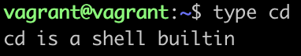
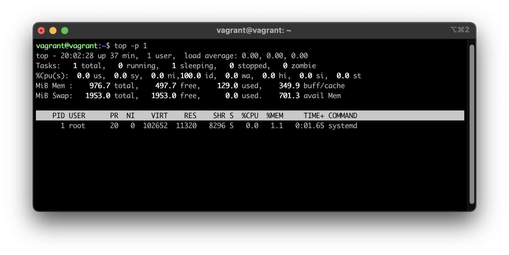

# Решение к [заданию](https://github.com/netology-code/sysadm-homeworks/blob/devsys10/03-sysadmin-02-terminal/README.md)

#### 1. Какого типа команда `cd`? Попробуйте объяснить, почему она именно такого типа: опишите ход своих мыслей, если считаете, что она могла бы быть другого типа.

> 
>
> `cd` является встроенной командой

#### 2. Какая альтернатива без pipe команде `grep <some_string> <some_file> | wc -l`?

> grep -c <some_string> <some_file>

#### 3. Какой процесс с PID `1` является родителем для всех процессов в вашей виртуальной машине Ubuntu 20.04?

> 
> systemd

#### 4. Как будет выглядеть команда, которая перенаправит вывод stderr `ls` на другую сессию терминала?

> `ls 2> /dev/pts/<сессия терминала>`, например `ls 2> /dev/pts/1`

#### 5. Получится ли одновременно передать команде файл на stdin и вывести ее stdout в другой файл? Приведите работающий пример.

> `head -n 2 < file1.txt 1> file2.txt`

#### 6. Получится ли, находясь в графическом режиме, вывести данные из PTY в какой-либо из эмуляторов TTY? Сможете ли вы наблюдать выводимые данные?

> - `echo 'hello' > /dev/tty1`
> - в данном случае все наблюдается в консоли запущенной машины в VBox

#### 7. Выполните команду `bash 5>&1`. К чему она приведет? Что будет, если вы выполните `echo netology > /proc/$$/fd/5`? Почему так происходит?

> - `bash 5>&1` создает файловый дескриптор `5` и перенаправляет его на stdout
> - `echo netology > /proc/$$/fd/5` выводит `netology` в дескриптор 5, который выводит в stdout текущего сессии

#### 8. Получится ли в качестве входного потока для pipe использовать только stderr команды, не потеряв при этом отображение stdout на pty?

    Напоминаем: по умолчанию через pipe передается только stdout команды слева от `|` на stdin команды справа.

Это можно сделать, поменяв стандартные потоки местами через промежуточный новый дескриптор, который вы научились создавать в предыдущем вопросе.

> Да, например так `ls -l /root 3>&2 2>&1 1>&3 | grep root`.

#### 9. Что выведет команда `cat /proc/$$/environ`? Как еще можно получить аналогичный по содержанию вывод?

> - Выведет переменные окружения
> - Аналогичные команды `env` и `prinenv`

#### 10. Используя `man`, опишите что доступно по адресам `/proc/<PID>/cmdline`, `/proc/<PID>/exe`.

> `/proc/<PID>/cmdline` содержит полную команду запуска процесса по PID,
> `/proc/<PID>/exe` симлинк с полным именем выполняемого процесса по PID.

#### 11. Узнайте, какую наиболее старшую версию набора инструкций SSE поддерживает ваш процессор с помощью `/proc/cpuinfo`.

> ```
> vagrant@vagrant:~$ cat /proc/cpuinfo | grep -o -e 'sse[0-9_]*' | sort -u
> sse
> sse2
> sse3
> sse4_1
> sse4_2
> ```
>
> `sse4_2` выглядит наиболее старшей версией

#### 12. При открытии нового окна терминала и `vagrant ssh` создается новая сессия и выделяется pty.

Это можно подтвердить командой `tty`, которая упоминалась в лекции 3.2.  
 Однако:

```bash
    vagrant@netology1:~$ ssh localhost 'tty'
    not a tty
```

    Почитайте, почему так происходит, и как изменить поведение.

> В приведенном примере при запуске команды через ssh не выделяется pty, исправить можно флагом `-t`

#### 13. Бывает, что есть необходимость переместить запущенный процесс из одной сессии в другую. Попробуйте сделать это, воспользовавшись `reptyr`. Например, так можно перенести в `screen` процесс, который вы запустили по ошибке в обычной SSH-сессии.

> Работает, делал согласно https://github.com/nelhage/reptyr

#### 14. `sudo echo string > /root/new_file` не даст выполнить перенаправление под обычным пользователем, так как перенаправлением занимается процесс shell'а, который запущен без `sudo` под вашим пользователем. Для решения данной проблемы можно использовать конструкцию `echo string | sudo tee /root/new_file`. Узнайте? что делает команда `tee` и почему в отличие от `sudo echo` команда с `sudo tee` будет работать.

> - `tee` выводит и в stdout и в один файл или несколько файлов
> - `sudo echo string > /root/new_file` под sudo выполнится команда echo, запись от обычного бесправного пользователя
> - `echo string | sudo tee /root/new_file` уже вывод и запись под рутом, а echo может и без прав выполниться
