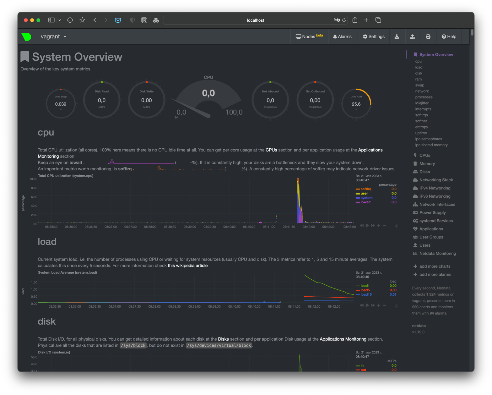

# Домашнее задание к занятию «Операционные системы. Лекция 2»

[Задание](https://github.com/netology-code/sysadm-homeworks/blob/devsys10/03-sysadmin-04-os/README.md)

## Задание

1. На лекции вы познакомились с [node_exporter](https://github.com/prometheus/node_exporter/releases). В демонстрации его исполняемый файл запускался в background. Этого достаточно для демо, но не для настоящей production-системы, где процессы должны находиться под внешним управлением. Используя знания из лекции по systemd, создайте самостоятельно простой [unit-файл](https://www.freedesktop.org/software/systemd/man/systemd.service.html) для node_exporter:

    * поместите его в автозагрузку;
    * предусмотрите возможность добавления опций к запускаемому процессу через внешний файл (посмотрите, например, на `systemctl cat cron`);
    * удостоверьтесь, что с помощью systemctl процесс корректно стартует, завершается, а после перезагрузки автоматически поднимается.

> - Установка
>   ```bash
>   wget https://github.com/prometheus/node_exporter/releases/download/v1.5.0/node_exporter-1.5.0.linux-amd64.tar.gz 
>   tar xvfz node_exporter-1.5.0.linux-amd64.tar.gz -C /tmp
>   cp /tmp/node_exporter-1.5.0.linux-amd64/node_exporter /usr/local/bin 
>   ```
> - unit-файл
>   ```bash
>   root@vagrant:~# vim /etc/systemd/system/node_exporter.service
>   
>   [Unit]
>   Description=Node Exporter
>   After=network.target
>   
>   [Service]
>   Type=simple
>   Restart=always
>   EnvironmentFile=/etc/default/node_exporter
>   ExecStart=/usr/local/bin/node_exporter $NODE_EXP_OPTS
>   
>   [Install]
>   WantedBy=multi-user.target 
>   ```
> - Инициализация `systemctl daemon-reload`
> - Автозагрузка `systemctl enable node_exporter.service`
> - Запуск `systemctl start node_exporter.service`
> - Лог
>   ```bash
>   root@vagrant:~# systemctl status node_exporter.service
>   node_exporter.service - Node Exporter
>   Loaded: loaded (/etc/systemd/system/node_exporter.service; enabled; vendor preset: enabled)
>   Active: active (running) since Fri 2023-05-19 22:45:41 UTC; 30min ago
>   Main PID: 1119 (node_exporter)
>    Tasks: 4 (limit: 1071)
>   Memory: 2.2M
>   CGroup: /system.slice/node_exporter.service
>         └─1119 /usr/local/bin/node_exporter
>   ```
> - Проверка автозагрузки
>   ```bash
>   root@vagrant:~# journalctl -u node_exporter.service --since today
>   -- Logs begin at Wed 2023-05-10 20:53:40 MSK, end at Fri 2023-05-19 23:51:50 MSK. --
>   May 19 22:46:51 vagrant systemd[1]: Started Node Exporter.  
>   ```
> - Передача дополнительных опций
>   > systemd будет загружать переменные окружения при старте node_exporter из файла /etc/default/node_exporter, а параметры запуска искать в переменной NODE_EXP_OPTS
>   ```
>   EnvironmentFile=/etc/default/node_exporter
>   ExecStart=/usr/local/bin/node_exporter $NODE_EXP_OPTS 
>   ```

***

2. Изучите опции node_exporter и вывод `/metrics` по умолчанию. Приведите несколько опций, которые вы бы выбрали для базового мониторинга хоста по CPU, памяти, диску и сети.

> - `node_cpu_seconds_total{cpu="*",mode="user"}`
> - `node_cpu_seconds_total{cpu="*",mode="system"}`
> - `node_cpu_seconds_total{cpu="*",mode="idle"}`
> - `node_cpu_seconds_total{cpu="*",mode="iowait"}`
> - `node_memory_MemFree_bytes`
> - `node_memory_MemTotal_bytes`
> - `node_filesystem_avail_bytes`
> - `node_filesystem_size_bytes`
> - `node_network_receive_bytes_total`
> - `node_network_transmit_bytes_total`

***

3. Установите в свою виртуальную машину [Netdata](https://github.com/netdata/netdata). Воспользуйтесь [готовыми пакетами](https://packagecloud.io/netdata/netdata/install) для установки (`sudo apt install -y netdata`). 
   
   После успешной установки:
   
    * в конфигурационном файле `/etc/netdata/netdata.conf` в секции [web] замените значение с localhost на `bind to = 0.0.0.0`;
    * добавьте в Vagrantfile проброс порта Netdata на свой локальный компьютер и сделайте `vagrant reload`:

    ```bash
    config.vm.network "forwarded_port", guest: 19999, host: 19999
    ```

    После успешной перезагрузки в браузере на своём ПК (не в виртуальной машине) вы должны суметь зайти на `localhost:19999`. Ознакомьтесь с метриками, которые по умолчанию собираются Netdata, и с комментариями, которые даны к этим метрикам.

> 

***

4. Можно ли по выводу `dmesg` понять, осознаёт ли ОС, что загружена не на настоящем оборудовании, а на системе виртуализации?

> Да, можно.
> ```bash
> vagrant@vagrant:~$ dmesg | grep -i virtual
> [    0.000000] DMI: innotek GmbH VirtualBox/VirtualBox, BIOS VirtualBox 12/01/2006
> [    0.003123] CPU MTRRs all blank - virtualized system.
> [    0.028211] Booting paravirtualized kernel on KVM
> [    3.856715] systemd[1]: Detected virtualization oracle.
> ```

***

5. Как настроен sysctl `fs.nr_open` на системе по умолчанию? Определите, что означает этот параметр. Какой другой существующий лимит не позволит достичь такого числа (`ulimit --help`)?

> - `fs.nr_open` - Определяет максимальное количество файловых дескрипторов, значение по-умолчанию составляет 1048576 (1048576/1024 = 1024)
> - Другой существующий лимит `ulimit -n` - Максимальное количество открытых файловых дескрипторов (1024)

***

6. Запустите любой долгоживущий процесс (не `ls`, который отработает мгновенно, а, например, `sleep 1h`) в отдельном неймспейсе процессов; покажите, что ваш процесс работает под PID 1 через `nsenter`. Для простоты работайте в этом задании под root (`sudo -i`). Под обычным пользователем требуются дополнительные опции (`--map-root-user`) и т. д.

> ```bash
> vagrant@vagrant:~$ unshare --user --pid --map-root-user --mount-proc --fork bash
> root@vagrant:~# ps -ef
> UID          PID    PPID  C STIME TTY          TIME CMD
> root           1       0  0 06:39 pts/4    00:00:00 bash
> root           7       1  0 06:40 pts/4    00:00:00 ps -ef
> root@vagrant:~# nsenter -t 1 -p -r ps -ef
> UID          PID    PPID  C STIME TTY          TIME CMD
> root           1       0  0 06:39 pts/4    00:00:00 bash
> root           8       1  0 06:40 pts/4    00:00:00 nsenter -t 1 -p -r ps -ef
> root           9       8  0 06:40 pts/4    00:00:00 ps -ef
> ```

***

7. Найдите информацию о том, что такое `:(){ :|:& };:`. Запустите эту команду в своей виртуальной машине Vagrant с Ubuntu 20.04 (**это важно, поведение в других ОС не проверялось**). Некоторое время всё будет плохо, после чего (спустя минуты) — ОС должна стабилизироваться. Вызов `dmesg` расскажет, какой механизм помог автоматической стабилизации.  
Как настроен этот механизм по умолчанию, и как изменить число процессов, которое можно создать в сессии?

> - `:(){ :|:& };:` - fork bomb, рекурсивный запуск команды
> - ```bash
>   root@vagrant:/# dmesg
>   ...
>   cgroup: fork rejected by pids controller in /user.slice/user-1000.slice/session-9.scope
>   ```
> - `cgroup` ограничивает количество используемых ресурсов, количество запущенных процессов пользователем
> - Изменить  лимит можно командой `ulimit -u N`
