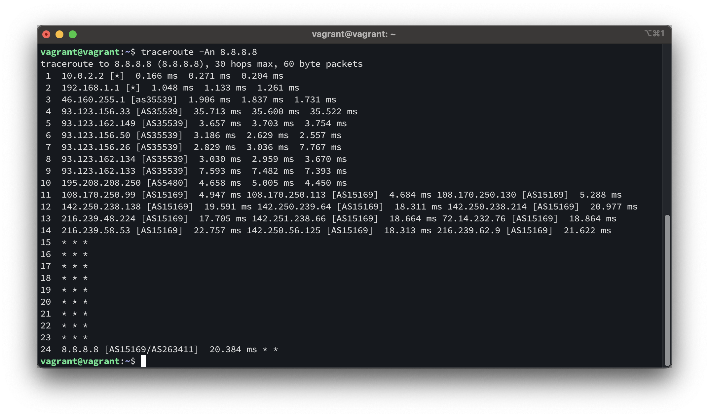

## Задание

https://github.com/netology-code/sysadm-homeworks/blob/devsys10/03-sysadmin-06-net/README.md

## Решение

### 1. Работа c HTTP через телнет.

- Подключитесь утилитой телнет к сайту stackoverflow.com
  `telnet stackoverflow.com 80`
- Отправьте HTTP запрос

```bash
GET /questions HTTP/1.0
HOST: stackoverflow.com
[press enter]
[press enter]
```

_В ответе укажите полученный HTTP код, что он означает?_

> HTTP/1.1 403 Forbidden
>
> 403 - доступ к запрошенному ресурсу запрещен. Сервер понял запрос, но не выполнит его.

### 2. Повторите задание 1 в браузере, используя консоль разработчика F12.

- откройте вкладку `Network`
- отправьте запрос http://stackoverflow.com
- найдите первый ответ HTTP сервера, откройте вкладку `Headers`
- укажите в ответе полученный HTTP код

> полученный код 200
> 

- проверьте время загрузки страницы, какой запрос обрабатывался дольше всего?

> дольше всего запрос изобржений png
> 

- приложите скриншот консоли браузера в ответ.

> 

### 3. Какой IP адрес у вас в интернете?

> 

### 4. Какому провайдеру принадлежит ваш IP адрес? Какой автономной системе AS? Воспользуйтесь утилитой `whois`

> 

### 5. Через какие сети проходит пакет, отправленный с вашего компьютера на адрес 8.8.8.8? Через какие AS? Воспользуйтесь утилитой `traceroute`

> 

### 6. Повторите задание 5 в утилите `mtr`. На каком участке наибольшая задержка - delay?

> 

### 7. Какие DNS сервера отвечают за доменное имя dns.google? Какие A записи? Воспользуйтесь утилитой `dig`

> 

### 8. Проверьте PTR записи для IP адресов из задания 7. Какое доменное имя привязано к IP? Воспользуйтесь утилитой `dig`

> 
