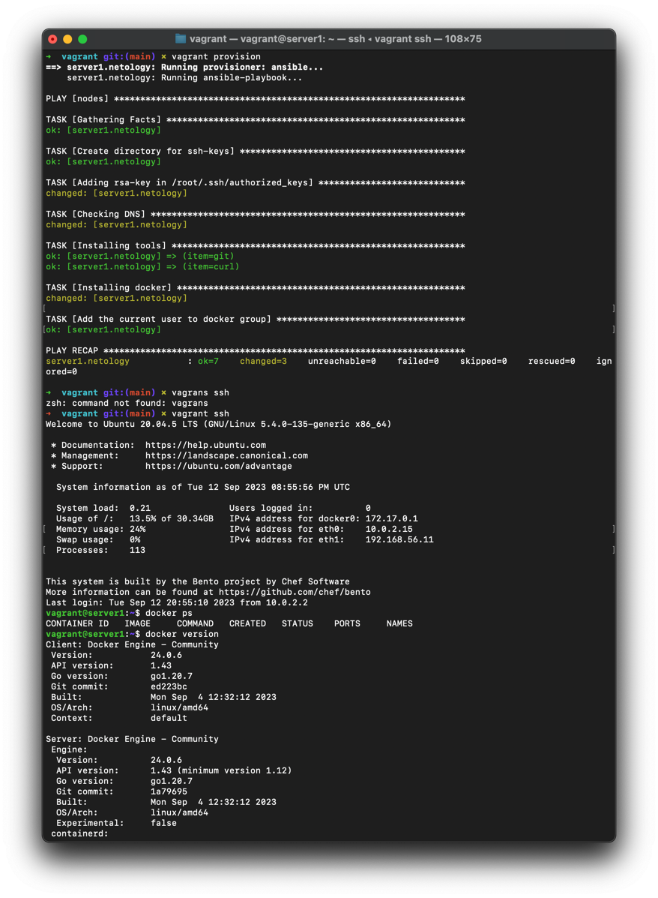

# Домашняя работа к занятию 2. «Применение принципов IaaC в работе с виртуальными машинами»

## Задача 1

- Опишите основные преимущества применения на практике IaaC-паттернов.
> - больший контроль над инфраструктурой
> - исключение ручной настройки ресурсов
> - значительно ускоряет процесс развертывания
> - повторяемость конфигураций
- Какой из принципов IaaC является основополагающим?
> Идемпотентность - это свойство объекта или операции, при повторном выполнении которой мы получаем результат идентичный предыдущему и всем последующим выполнениям.

## Задача 2

- Чем Ansible выгодно отличается от других систем управление конфигурациями?
> Отсутствие агентов, которые необходимо устанавливать на конфигурируемые сервера, вся конфигурация происходит по SSH
- Какой, на ваш взгляд, метод работы систем конфигурации более надёжный — push или pull?
> Гибридный. Для выделения конкретного метода недостаточно данных, нам не известна инфрастуктура и состояние целевых узлов

## Задача 3

Установите на личный компьютер:

- [VirtualBox](https://www.virtualbox.org/),
- [Vagrant](https://github.com/netology-code/devops-materials),
- [Terraform](https://github.com/netology-code/devops-materials/blob/master/README.md),
- Ansible.

*Приложите вывод команд установленных версий каждой из программ, оформленный в Markdown.*

>```bash
>➜  ~ vboxmanage -v
>7.0.10r158379
>➜  ~ virtualbox -h       
>Oracle VM VirtualBox VM Selector v7.0.10
>Copyright (C) 2005-2023 Oracle and/or its affiliates
>
>No special options.
>
>If you are looking for --startvm and related options, you need to use VirtualBoxVM.
>```
>
>```bash
> ➜  ~ vagrant --version
> Vagrant 2.3.7
> ```
> 
> ```bash
> ➜  ~ terraform --version
> Terraform v1.5.7
> on darwin_amd64
> ```
> 
> ```bash
> ➜  ~ ansible --version
> ansible [core 2.15.3]
>   config file = None
>   configured module search path = ['/Users/andrej/.ansible/plugins/modules', '/usr/share/ansible/plugins/modules']
>   ansible python module location = /usr/local/Cellar/ansible/8.3.0/libexec/lib/python3.11/site-packages/ansible
>   ansible collection location = /Users/andrej/.ansible/collections:/usr/share/ansible/collections
>   executable location = /usr/local/bin/ansible
>   python version = 3.11.5 (main, Aug 24 2023, 15:18:16) [Clang 14.0.3 (clang-1403.0.22.14.1)] (/usr/local/Cellar/ansible/8.3.0/libexec/bin/python)
>   jinja version = 3.1.2
>   libyaml = True
> ```

## Задача 4 

Воспроизведите практическую часть лекции самостоятельно.

- Создайте виртуальную машину.
- Зайдите внутрь ВМ, убедитесь, что Docker установлен с помощью команды
```
docker ps,
```
Vagrantfile из лекции и код ansible находятся в [папке](https://github.com/netology-code/virt-homeworks/tree/virt-11/05-virt-02-iaac/src).

> 
