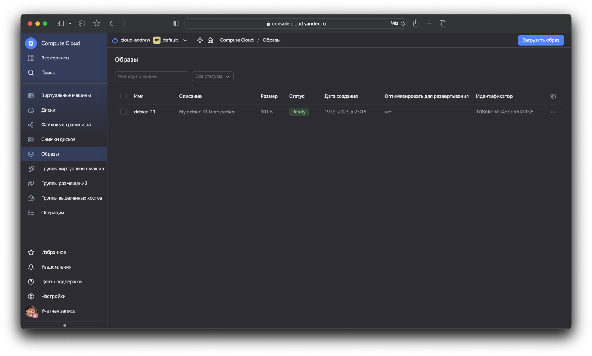
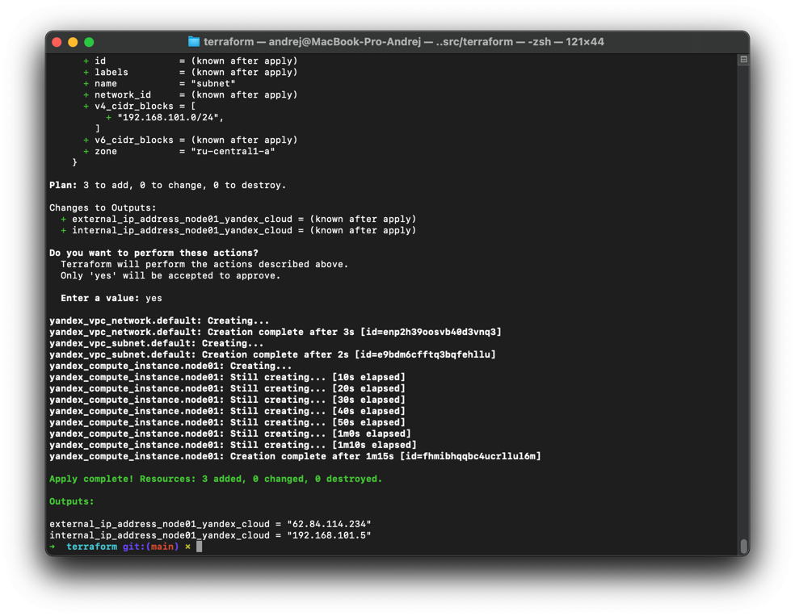
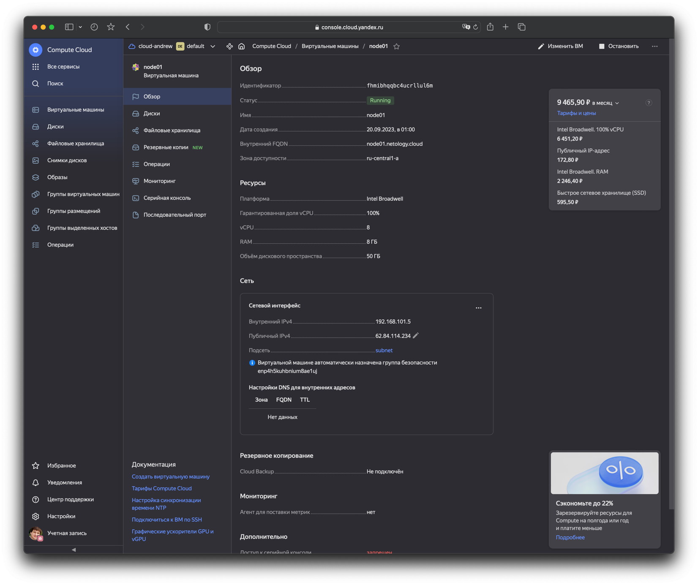
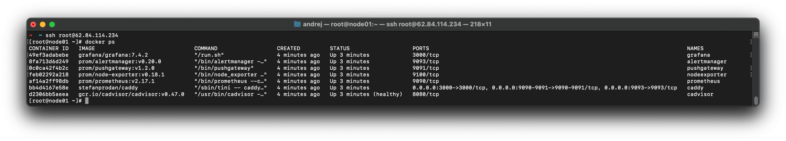
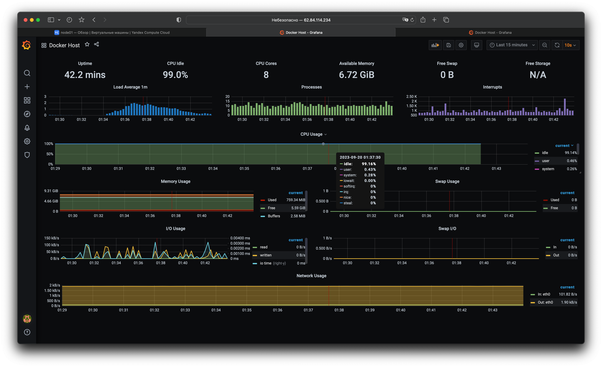
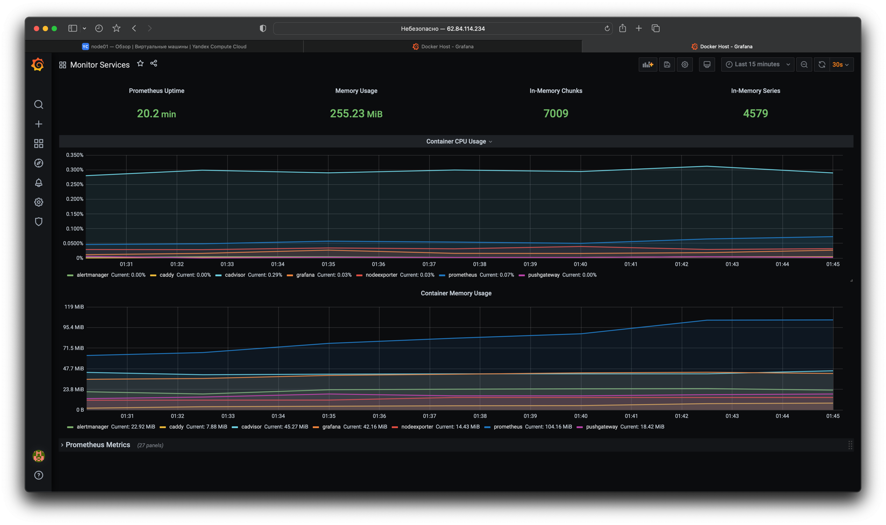

# Домашняя работа к занятию 4. «Оркестрация группой Docker-контейнеров на примере Docker Compose»

## Задача 1

Создайте собственный образ любой операционной системы (например, debian-11) с помощью Packer ([инструкция для установки плагина yandex-cloud](https://cloud.yandex.ru/docs/tutorials/infrastructure-management/packer-quickstart)).

Чтобы получить зачёт, вам нужно предоставить скриншот страницы с созданным образом из личного кабинета YandexCloud.

> 

## Задача 2

**2.1.** Создайте вашу первую виртуальную машину в YandexCloud с помощью web-интерфейса YandexCloud.        

**2.2.*** **(Необязательное задание)**      
Создайте вашу первую виртуальную машину в YandexCloud с помощью Terraform (вместо использования веб-интерфейса YandexCloud).
Используйте Terraform-код в директории ([src/terraform](https://github.com/netology-group/virt-homeworks/tree/virt-11/05-virt-04-docker-compose/src/terraform)).

Чтобы получить зачёт, вам нужно предоставить вывод команды terraform apply и страницы свойств, созданной ВМ из личного кабинета YandexCloud.

> 
> ```bash
> ➜  terraform git:(main) ✗ terraform apply                           
> 
> Terraform used the selected providers to generate the following execution plan. Resource actions are indicated with the following symbols:
>   + create
> 
> Terraform will perform the following actions:
> 
>   # yandex_compute_instance.node01 will be created
>   + resource "yandex_compute_instance" "node01" {
>       + allow_stopping_for_update = true
>       + created_at                = (known after apply)
>       + folder_id                 = (known after apply)
>       + fqdn                      = (known after apply)
>       + gpu_cluster_id            = (known after apply)
>       + hostname                  = "node01.netology.cloud"
>       + id                        = (known after apply)
>       + metadata                  = {
>           + "ssh-keys" = <<-EOT
>                 centos:ssh-rsa AAAAB3NzaC1yc2EAAAADAQABAAABgQCpQdGRVz+OE911Aim4fhvCnscG3sn0m8iXCs6eFkcrrCdNllB8OExWMgxnNpRyAFnqZch8o7aVSPPnik6lzdGyDFvIJIyopx5irYOULE7moURVTCFOuNdLpo1kKaIL8exs8c3VjyCWrx/iLnYwLYM64jgM1sg8C4dXs+c+K6ZvZT9QAulGWIFZApZCWxQeBIWTI+7z5/5HHIx7fSO6YfOMeRifEzscWODOH/n1wL93WCWBszwL1DqwowqRUplTcJMAGTmnN8MBcqhfW3KPdVfmI6bw7WaO3tsYxwHdf+4xskpgG1l0bR3lzTQtZFyUSL7+8Oj/t4Hv9LHgDwvWdx7kVAFJziXge3lSbJetZchW9TmO9a4v4JPtvu9GNP8DCPe68KGY7SSM+qu/JDKpg/WiX7/nEPuQplXAW6lljnIXctWr7tMeg1dCHtovEGzQeJ7XeWp9m9cn0m8sO/66xmQT2fsGC14mCz5Ooy0y4Z1GEpfL+5cmJmHCnIOE0jHkwJM= andrej@MacBook-Pro-Andrej.local
>             EOT
>         }
>       + name                      = "node01"
>       + network_acceleration_type = "standard"
>       + platform_id               = "standard-v1"
>       + service_account_id        = (known after apply)
>       + status                    = (known after apply)
>       + zone                      = "ru-central1-a"
> 
>       + boot_disk {
>           + auto_delete = true
>           + device_name = (known after apply)
>           + disk_id     = (known after apply)
>           + mode        = (known after apply)
> 
>           + initialize_params {
>               + block_size  = (known after apply)
>               + description = (known after apply)
>               + image_id    = "fd8mj7tipc86tt4f9src"
>               + name        = "root-node01"
>               + size        = 50
>               + snapshot_id = (known after apply)
>               + type        = "network-nvme"
>             }
>         }
> 
>       + network_interface {
>           + index              = (known after apply)
>           + ip_address         = (known after apply)
>           + ipv4               = true
>           + ipv6               = (known after apply)
>           + ipv6_address       = (known after apply)
>           + mac_address        = (known after apply)
>           + nat                = true
>           + nat_ip_address     = (known after apply)
>           + nat_ip_version     = (known after apply)
>           + security_group_ids = (known after apply)
>           + subnet_id          = (known after apply)
>         }
> 
>       + resources {
>           + core_fraction = 100
>           + cores         = 8
>           + memory        = 8
>         }
>     }
> 
>   # yandex_vpc_network.default will be created
>   + resource "yandex_vpc_network" "default" {
>       + created_at                = (known after apply)
>       + default_security_group_id = (known after apply)
>       + folder_id                 = (known after apply)
>       + id                        = (known after apply)
>       + labels                    = (known after apply)
>       + name                      = "net"
>       + subnet_ids                = (known after apply)
>     }
> 
>   # yandex_vpc_subnet.default will be created
>   + resource "yandex_vpc_subnet" "default" {
>       + created_at     = (known after apply)
>       + folder_id      = (known after apply)
>       + id             = (known after apply)
>       + labels         = (known after apply)
>       + name           = "subnet"
>       + network_id     = (known after apply)
>       + v4_cidr_blocks = [
>           + "192.168.101.0/24",
>         ]
>       + v6_cidr_blocks = (known after apply)
>       + zone           = "ru-central1-a"
>     }
> 
> Plan: 3 to add, 0 to change, 0 to destroy.
> 
> Changes to Outputs:
>   + external_ip_address_node01_yandex_cloud = (known after apply)
>   + internal_ip_address_node01_yandex_cloud = (known after apply)
> 
> Do you want to perform these actions?
>   Terraform will perform the actions described above.
>   Only 'yes' will be accepted to approve.
> 
>   Enter a value: yes
> 
> yandex_vpc_network.default: Creating...
> yandex_vpc_network.default: Creation complete after 3s [id=enp2h39oosvb40d3vnq3]
> yandex_vpc_subnet.default: Creating...
> yandex_vpc_subnet.default: Creation complete after 2s [id=e9bdm6cfftq3bqfehllu]
> yandex_compute_instance.node01: Creating...
> yandex_compute_instance.node01: Still creating... [10s elapsed]
> yandex_compute_instance.node01: Still creating... [20s elapsed]
> yandex_compute_instance.node01: Still creating... [30s elapsed]
> yandex_compute_instance.node01: Still creating... [40s elapsed]
> yandex_compute_instance.node01: Still creating... [50s elapsed]
> yandex_compute_instance.node01: Still creating... [1m0s elapsed]
> yandex_compute_instance.node01: Still creating... [1m10s elapsed]
> yandex_compute_instance.node01: Creation complete after 1m15s [id=fhmibhqqbc4ucrllul6m]
> 
> Apply complete! Resources: 3 added, 0 changed, 0 destroyed.
> 
> Outputs:
> 
> external_ip_address_node01_yandex_cloud = "62.84.114.234"
> internal_ip_address_node01_yandex_cloud = "192.168.101.5"
> ➜  terraform git:(main) ✗ 
> ```
> 
> 

## Задача 3

С помощью Ansible и Docker Compose разверните на виртуальной машине из предыдущего задания систему мониторинга на основе Prometheus/Grafana.
Используйте Ansible-код в директории ([src/ansible](https://github.com/netology-group/virt-homeworks/tree/virt-11/05-virt-04-docker-compose/src/ansible)).

Чтобы получить зачёт, вам нужно предоставить вывод команды "docker ps" , все контейнеры, описанные в [docker-compose](https://github.com/netology-group/virt-homeworks/blob/virt-11/05-virt-04-docker-compose/src/ansible/stack/docker-compose.yaml),  должны быть в статусе "Up".

> 
> 
> ```bash
> ➜  ~ ssh root@62.84.114.234
> [root@node01 ~]# docker ps
> CONTAINER ID   IMAGE                              COMMAND                  CREATED         STATUS                   PORTS                                                                              NAMES
> 49ef3adabebe   grafana/grafana:7.4.2              "/run.sh"                4 minutes ago   Up 3 minutes             3000/tcp                                                                           grafana
> 8fa713d6d249   prom/alertmanager:v0.20.0          "/bin/alertmanager -…"   4 minutes ago   Up 3 minutes             9093/tcp                                                                           alertmanager
> 0c0ca42f4b2c   prom/pushgateway:v1.2.0            "/bin/pushgateway"       4 minutes ago   Up 3 minutes             9091/tcp                                                                           pushgateway
> feb02292a218   prom/node-exporter:v0.18.1         "/bin/node_exporter …"   4 minutes ago   Up 3 minutes             9100/tcp                                                                           nodeexporter
> af14a2ff98db   prom/prometheus:v2.17.1            "/bin/prometheus --c…"   4 minutes ago   Up 3 minutes             9090/tcp                                                                           prometheus
> bb4d4167e58e   stefanprodan/caddy                 "/sbin/tini -- caddy…"   4 minutes ago   Up 3 minutes             0.0.0.0:3000->3000/tcp, 0.0.0.0:9090-9091->9090-9091/tcp, 0.0.0.0:9093->9093/tcp   caddy
> d2306bb5aeea   gcr.io/cadvisor/cadvisor:v0.47.0   "/usr/bin/cadvisor -…"   4 minutes ago   Up 3 minutes (healthy)   8080/tcp                                                                           cadvisor
> [root@node01 ~]# 
> 
> ```

## Задача 4

1. Откройте веб-браузер, зайдите на страницу http://<внешний_ip_адрес_вашей_ВМ>:3000.
2. Используйте для авторизации логин и пароль из [.env-file](https://github.com/netology-group/virt-homeworks/blob/virt-11/05-virt-04-docker-compose/src/ansible/stack/.env).
3. Изучите доступный интерфейс, найдите в интерфейсе автоматически созданные docker-compose-панели с графиками([dashboards](https://grafana.com/docs/grafana/latest/dashboards/use-dashboards/)).
4. Подождите 5-10 минут, чтобы система мониторинга успела накопить данные.

Чтобы получить зачёт, предоставьте: 

- скриншот работающего веб-интерфейса Grafana с текущими метриками

> 
> 
> 

